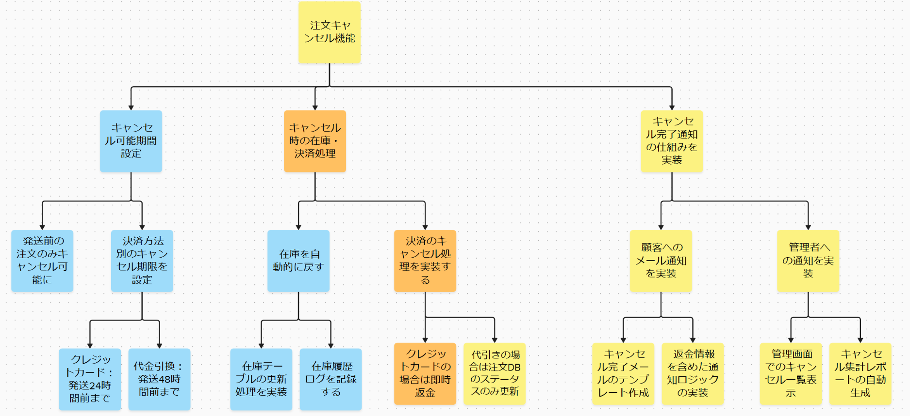
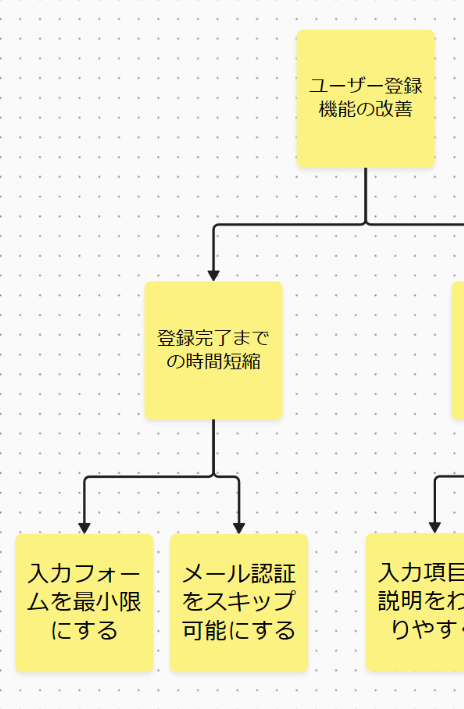
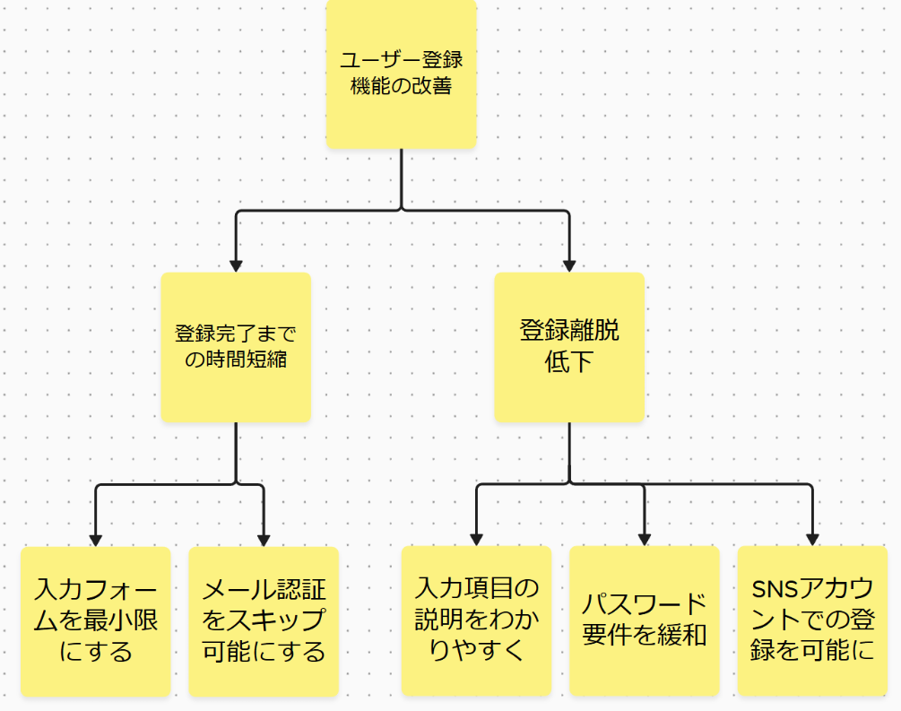
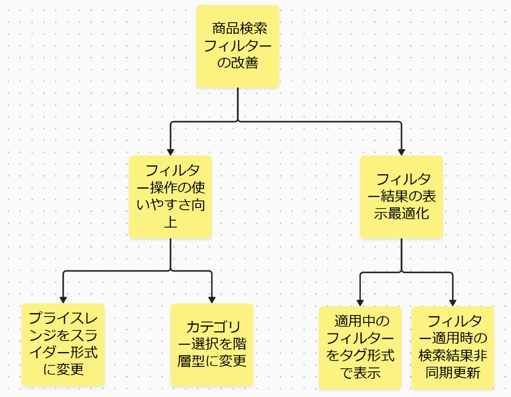
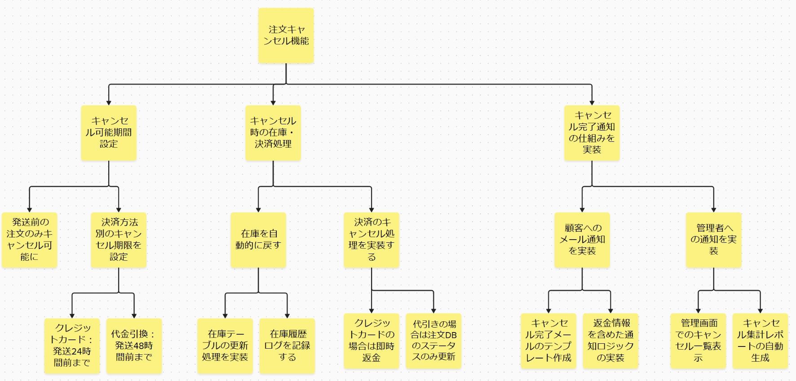
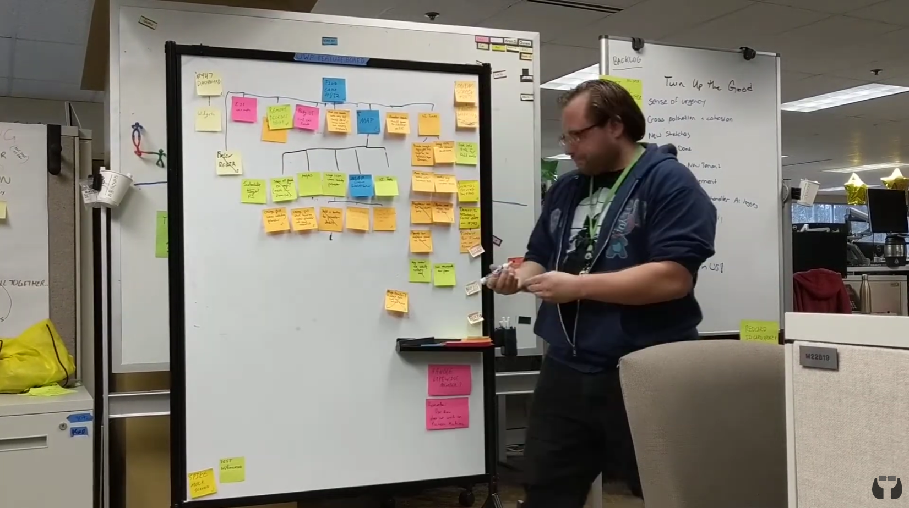
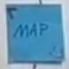
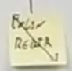

# ディスカバリーツリーについて

ぼのたけ 今井健男

---
# ディスカバリーツリーとは

やるべき活動アイテムとその進捗をツリーで示したもの。

FASTではプロダクトバックログの代わりに利用するのが推奨されている。

---
# 作り方・使い方（1）

1. 目的・アウトカムを木のルートにする
2. 着手するアイテムを解くべき課題と見立て、その課題を解消するためのアイテムを下に並べる。これにより、

     - 上にあるアイテムは、そのアイテムのwhyを示し、
     - 下にあるアイテムは、そのアイテムのhowを示すようになる。

---

# 作り方・使い方（2）

基本的には、着手するアイテムを解くべき課題と見立て、その課題を解消するためのアイテムを下に並べていくようにする。

- 子アイテムが全て解消されれば、対象アイテムの課題も解消されるようにする
  - 後で足りないものが出てくれば適時追加すれば良い
- 子アイテムとしては、主に以下の2つ
  - 対象アイテムの課題を分割した部分課題
  - アイテムの課題を解消するためのアイテム（ソリューション）

---

# 例1: 「ユーザー登録機能の改善」ディスカバリー

---

# 例2: 「商品検索フィルターの改善」デザイン

---

# 例3: 「注文キャンセル機能」デリバリー

---

# 進捗の表現（オンライン版）

miroやMuralを利用する場合、付箋を色分けして進捗を表す。
（この例では、黄色：ToDo, オレンジ：WIP, 青：Done）
子が WIP の場合、親も WIP になる

---

# 　進捗の表現（オフライン版）　

YouTube ["Quick Discovery Tree Overview"](https://youtu.be/niIW3FsClVY?si=sfzVVnktrt5-25HB) より

---

# 進捗の表現（オフライン版）

WIPは角にカギカッコを書き、Doneは対角線に斜線を引く

